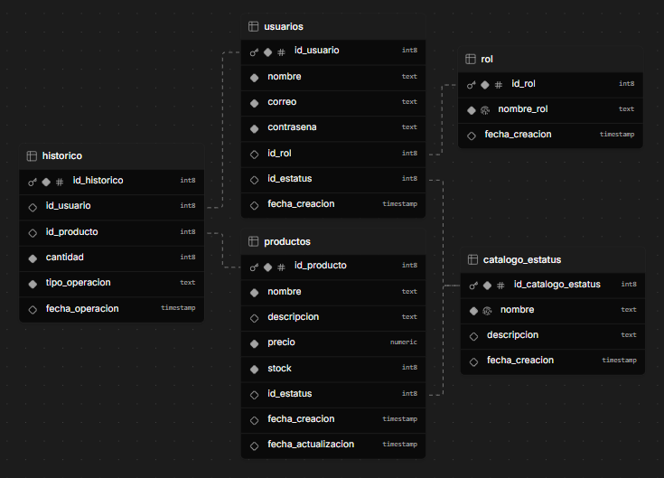

# Evaluacion Tecnica — Grupo Castores

Este repositorio contiene el código y las respuestas de la evaluación técnica de programación.

---

## Contenido

- [Conocimiento de SQL](#conocimiento-de-sql)
- [Ejercicio práctico BD](#ejercicio-práctico-bd)
- [Scripts SQL](#22-scripts)
- [Avance actual del backend](#3--avance-actual-del-backend)

## 1.- Conocimiento de SQL

En la raíz del repositorio se incluye un PDF con las respuestas a las preguntas de la evaluación práctica: [Respuestas_Evaluacion_Practica.pdf](Respuestas_Evaluacion_Practica.pdf)

## 2.- Ejercicio práctico BD

### 2.1 Diagrama de la base de datos

Para este ejercicio se solicita un diagrama relacional que muestre las relaciones entre `usuarios` y las demás tablas creadas para resolver el escenario descrito. La imagen se adjunta en la raíz del repositorio y se muestra a continuación.

### 2.2 Scripts

Se crea la carpeta `scripts/` para almacenar los archivos SQL relacionados con la creación de tablas, relaciones e inserts.

## 3.- Avance actual del backend

En la carpeta `back/` se avanzó en una API con FastAPI para autenticación y productos.

### Endpoints implementados

- `POST /login`
- `GET /obtener_productos` (requiere token)
- `POST /agregar_producto` (requiere token)
- `PUT /activar_producto/{id_producto}` (requiere token)
- `PUT /desactivar_producto/{id_producto}` (requiere token)

### Autenticación y acceso a datos

- Generación y validación de JWT con `python-jose`.
- Conexión a MySQL mediante SQLAlchemy usando `pymysql`.
- Carga de variables de entorno con `python-dotenv` desde `.env`.

### Dependencias del backend

Las dependencias se encuentran en `back/requirements.txt` e incluyen las librerías necesarias para correr la API y la conexión a base de datos.

---

